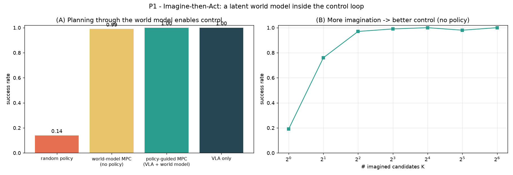

# Vision-Language-Action models + World Models: a research portfolio

Four self-contained studies on **Vision-Language-Action (VLA) policies and world models**:
where a VLA breaks, how to fix it, and how a world model can control and imagine. Built as
preparation for a master thesis on VLAs and World Models.

Everything runs in about 10 to 15 minutes on a single Apple-silicon laptop (MPS). No cluster
and no proprietary checkpoints: a deliberately **controlled testbed** so every claim is a
clean, reproducible ablation. The methods are written to transfer to real VLA stacks
(SmolVLA / Octo / pi-0) on PushT / LIBERO; the policy and world-model interfaces are the swap
points.

```bash
uv sync
bash scripts/run_all.sh        # trains everything, writes all figures to results/
```

---

## The through-line

Two threads over one shared VLA. First, **VLA robustness**: diagnose a failure (P3), then fix
it (P4). Second, **world models**: use one to control (P1) and to imagine (P2).

| | Question | Result |
|---|---|---|
| **P3** | *When does a VLA fail?* | diagnose: vision-robust, language-brittle (100% to about 6% under paraphrase) |
| **P4** | *Can we fix that failure?* | fix: instruction augmentation restores held-out paraphrases to about 1.00 |
| **P1** | *Can a world model control the agent?* | control: planning through a latent world model reaches 0.99 with no policy |
| **P2** | *Can a world model replace the simulator?* | imagine: dream action-conditioned rollouts for data and eval |

The shared core is a genuine VLA: a CNN with **FiLM language-conditioning + spatial-softmax
keypoints** that grounds an instruction ("reach the red object") in pixels and emits
continuous actions. It reaches **100% success in-distribution**.

---

## P3: When do VLAs fail? (failure analysis)

A controlled distribution-shift study of the trained VLA, one axis at a time.


**Finding: the VLA is vision-robust but language-brittle.** It shrugs off heavy distractor
overload and strong visual noise (sigma up to 0.5 still gives 96%), but **collapses to about
6% on benign instruction paraphrases** ("go to the red one") and to about 7% on **novel
colors**, failing *confidently* by driving to the wrong object. Language generalization, not
perception, is the bottleneck. See `p3_failure_analysis/`.

## P4: Fixing the language bottleneck (closes the P3 loop)

The same architecture trained on a **pool of instruction phrasings** instead of one, then
tested on **held-out phrasings never seen in training**.


**Finding: instruction augmentation closes the gap.** Held-out paraphrases go from 0.05 to
0.09 (baseline) up to 0.99 to 1.00 (augmented), with no loss in-distribution. P3's brittleness
was a training-coverage problem, fixed exactly as a deployment engineer would. The fix is
language-side; the novel-color (visual generalization) axis stays open. See
`p4_language_robustness/`.

## P1: Imagine-then-Act (world-model control)

A **latent world model** (language-conditioned encoder, latent transition, distance-to-goal
head) inside the control loop. Model-predictive control imagines K candidate action sequences
and executes the one whose imagined rollout best reaches the goal.



**Finding: planning through the learned world model controls the agent.** With **no policy at
all**, random-shooting MPC reaches **0.99** (vs 0.14 random), and success rises cleanly with
the number of imagined candidates K. Getting here required fixing **world-model exploitation**:
a model trained only on expert data is inaccurate off-distribution and the planner exploits its
errors; training on exploratory data fixes it (a core model-based-RL lesson). See
`p1_imagine_then_act/`.

## P2: Action-conditioned dreaming (generative world model)

A convolutional action-conditioned frame predictor (UniSim / Genie in miniature) rolled out
autoregressively to **dream** a trajectory from a single start frame and an action sequence.


**Finding: the model dreams plausible action-conditioned futures.** The agent moves along the
commanded actions while the scene stays consistent, with the characteristic compounding drift
of pixel-space world models (quantified in `results/p2_rollout_error.png`). Such a model is a
neural simulator for generating synthetic VLA training and eval data. See `p2_video_world_model/`.

---

## Why a toy testbed (and not OpenVLA on LIBERO)?

Deliberate. Real 7B VLAs need a cluster and days; here every figure is a controlled,
single-variable ablation reproducible in minutes, which is exactly what is needed to *isolate
mechanisms* (the language-brittleness in P3, the coverage fix in P4, model-exploitation in P1).
The architecture (FiLM + spatial-softmax grounding), the planning machinery (latent MPC), and
the generative world model are the same ideas used at scale; `ReachEnv` is the only swappable
part.

## Layout

```
src/vlawm/             shared core: env, VLA policy, world models, eval harness
p1_imagine_then_act/   latent world-model MPC
p2_video_world_model/  action-conditioned dreaming
p3_failure_analysis/   distribution-shift study (diagnosis)
p4_language_robustness/ instruction augmentation (the fix)
scripts/               training entry points + run_all.sh
```

Each project folder has its own README with a detailed walkthrough and a thesis-style write-up.
