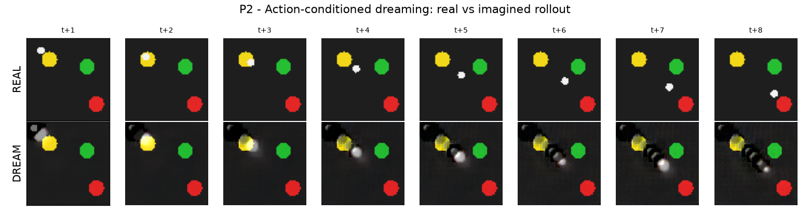

# P2: Action-conditioned video world model

A generative world model that predicts future camera frames given actions, and dreams whole
trajectories autoregressively from a single start frame.

## The one-sentence idea

Train a network that takes the current frame and an action and outputs the next frame. Apply
it to its own predictions step after step, and it dreams a video of an imagined rollout: a
neural simulator that renders what would happen if the agent executed a given action sequence,
without the real environment.

## The pieces

### The model, in `src/vlawm/worldmodel/video_wm.py`
A convolutional encoder-decoder. The encoder compresses the frame, the action is concatenated
in the bottleneck, and the decoder predicts the next frame as a residual on the input (which
keeps the static background crisp). The `dream` method rolls the model out autoregressively:
feed frame 0 and an action sequence, and each predicted frame becomes the input for the next
step.

### Training, in `run_video_wm.py`
Two ingredients make the small moving agent actually move in the dream:
- **Free-running multi-step loss**: instead of only one-step prediction, we unroll H steps and
  supervise every predicted frame against ground truth, so the model is trained on its own
  rollouts and does not stall.
- **Change-weighted pixel loss**: pixels that change between consecutive frames (the moving
  agent) are upweighted, so the loss is not dominated by the static background.

## How to run

Self-contained (it generates its own demonstration data if needed):

```bash
uv run python p2_video_world_model/run_video_wm.py --epochs 30
```

Outputs:
- `results/p2_dream_vs_real.png`: filmstrip comparing the real rollout (top) and the dreamed
  rollout (bottom).
- `results/p2_rollout_error.png`: per-step pixel error of autoregressive dreaming.
- `results/p2_dream.gif`: the dreamed trajectory animated.

## Result



**The model dreams plausible action-conditioned futures.** The dreamed agent moves along the
commanded actions while the scene stays consistent, with the characteristic compounding drift
of pixel-space world models: prediction error grows with the rollout horizon
(`results/p2_rollout_error.png`). Such a model is a neural simulator that could render
synthetic trajectories for training or evaluating a policy without a hand-built simulator.

Code: `src/vlawm/worldmodel/video_wm.py`.

---

# Write-up

A structured account of this study in the format of a short research note, mapping the
content onto Introduction, Related Work, Method, Experiments, Results, Discussion,
Limitations, and Future Work.

## 1. Introduction

A world model that predicts directly in pixel space can serve as a learned simulator: given a
start observation and a sequence of actions, it renders the imagined future. Such models are
attractive because they can in principle generate unlimited synthetic experience and visualize
a policy's intended behavior. The central difficulty is autoregressive stability, since errors
made early in a rollout feed back as inputs and compound. This study builds a small
action-conditioned video model and characterizes its dreaming quality and its drift.

We ask:

> **Can a laptop-scale action-conditioned frame predictor dream coherent rollouts in which the
> agent moves as commanded, and how quickly does autoregressive error accumulate?**

## 2. Related work

- **Pixel-space world models.** Action-conditioned video prediction (for example Oh et al.,
  2015) and recurrent world models (Ha & Schmidhuber, 2018) predict future frames from actions.
- **Large neural simulators.** UniSim (Yang et al., 2023) and Genie (Bruce et al., 2024) learn
  action-conditioned generative environments at scale; this project is a deliberately small
  reproduction of that idea.
- **Compounding error.** Autoregressive rollout drift is a well-documented issue; remedies
  include multi-step (free-running) training and scheduled sampling (Bengio et al., 2015).

## 3. Method

**Architecture.** A convolutional encoder-decoder mapping (frame, action) to the next frame,
with residual prediction around the input frame to preserve the static background.

**Training.** Free-running multi-step rollouts supervised at every step, combined with a
change-weighted pixel loss that upweights regions that move between consecutive frames. Both
are necessary so that the small agent is reproduced and moves rather than fading into the
background.

**Dreaming.** From a single real start frame and a recorded action sequence, the model is
unrolled autoregressively to produce an imagined video, which is compared frame by frame to
the ground-truth rollout.

## 4. Experiments

We train on scripted demonstrations and evaluate two things: a qualitative filmstrip of real
versus dreamed rollouts, and a quantitative per-step pixel error averaged over many episodes as
a function of the autoregressive horizon.

## 5. Results

The dreamed agent tracks the commanded actions while objects remain fixed and consistent.
Pixel error grows with rollout length, the expected signature of compounding error, before
saturating once the agent settles near the target. Artifacts (faint trails behind the moving
agent) are visible and are typical of residual pixel-space prediction. See
`results/p2_dream_vs_real.png` and `results/p2_rollout_error.png`.

## 6. Discussion

Even at laptop scale and with a tiny moving object, a simple frame predictor can be coaxed into
stable, action-faithful dreaming once the training objective accounts for autoregressive use
and for the imbalance between moving and static pixels. The remaining drift and trailing
artifacts are the natural target for the standard scaling and architectural remedies.

## 7. Limitations

- The scene is simple and low-resolution; high-resolution, cluttered, or contact-rich scenes
  are untested and would stress both fidelity and stability.
- The model is deterministic; it cannot represent stochastic futures or uncertainty.
- Dreaming is evaluated against recorded action sequences, not yet used to train or evaluate a
  downstream policy.

## 8. Future work

- Use the dreamed rollouts as synthetic data and measure whether they improve a policy.
- Add latent stochasticity or an ensemble to represent uncertainty and reduce confident drift.
- Scale resolution and horizon and adopt scheduled sampling or perceptual losses to cut
  trailing artifacts.

## Reproducibility

`uv run python p2_video_world_model/run_video_wm.py --epochs 30` regenerates the model and all
figures. The script generates its own dataset if one is not cached.
