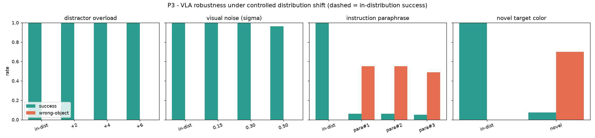

# P3: When do VLAs fail?

A controlled distribution-shift study of a trained Vision-Language-Action policy. We perturb
one axis at a time and measure where the policy breaks.

## The one-sentence idea

Take a VLA that reaches 100% success in-distribution, then stress it along four independent
axes (visual clutter, sensor noise, language phrasing, unseen colors) and ask which kind of
shift actually causes failure. Single-variable perturbations isolate the cause.

## The perturbation axes

All are controlled by the `Perturbation` config (`src/vlawm/envs/reach.py`):
- `distractor_overload`: add more non-target objects than were seen in training.
- `visual_noise`: additive Gaussian pixel noise (sensor corruption), swept over sigma.
- `paraphrase_idx`: rephrase the same instruction ("reach the red object" becomes "go to the
  red one"), using words the policy never saw at training time.
- `novel_target_color`: the target uses a held-out color, which maps to an unknown language
  token, making it genuinely out-of-distribution.

Each axis is evaluated with the shared harness (`src/vlawm/eval/harness.py`) over fixed seeds,
reporting both success rate and **wrong-object rate** (ended nearest a distractor): the latter
tells us whether failures are confident grounding errors rather than mere timeouts.

## How to run

Needs the trained policy (`results/policy.pt`).

```bash
uv run python scripts/train_policy.py --episodes 2500 --epochs 60   # if not already trained
uv run python p3_failure_analysis/run_failure_analysis.py           # → results/p3_failure_analysis.png
```

Outputs: `results/p3_failure_analysis.png` (the four-panel figure) and `results/p3_metrics.json`.

## Result



**The VLA is vision-robust but language-brittle.** It shrugs off heavy distractor overload and
strong visual noise (sigma up to 0.5 still gives 96%), but **collapses to about 6% under benign
instruction paraphrases** and to about 7% under **novel colors**. Crucially it fails
*confidently*: the wrong-object rate jumps, meaning the policy drives decisively to the wrong
object rather than stalling. Language generalization, not perception, is the bottleneck.

## Honest caveat (state this yourself)

The language module is deliberately small (a bag-of-embeddings text encoder), so part of the
paraphrase brittleness is by construction. The transferable contribution is the **method**:
controlled, single-axis stress-testing that separates perception robustness from language
robustness, and the **wrong-object metric** that distinguishes confident errors from timeouts.

Code: `src/vlawm/eval/harness.py`, `src/vlawm/envs/reach.py`.

---

# Write-up (thesis-style)

A structured account of this study in the format of a thesis chapter or short paper, mapping
the content onto Introduction, Related Work, Method, Experiments, Results, Discussion,
Limitations, and Future Work.

## 1. Introduction

Vision-Language-Action (VLA) policies are typically trained by behavior cloning and reach high
success on the training distribution. Aggregate success rate, however, hides *where* and *how*
a policy fails. A policy can be perfectly accurate in-distribution yet brittle to small,
benign shifts at deployment, and it may fail silently (timing out) or confidently (committing
to a wrong action). This study builds a controlled diagnostic that separates these cases.

We ask:

> **Along which axis of distribution shift (visual clutter, sensor noise, language phrasing,
> unseen attributes) does a competent VLA actually break, and does it fail confidently?**

On our testbed the answer is sharp: the policy is robust to visual shifts but collapses under
language paraphrase and unseen colors, and it does so by confidently reaching the wrong object.

## 2. Related work

- **Robustness and generalization of robot policies.** Benchmarks such as LIBERO (Liu et al.,
  2023) and evaluation suites for RT-2 (Brohan et al., 2023) and OpenVLA (Kim et al., 2024)
  probe generalization to new objects, scenes, and instructions; our study reproduces this
  spirit with controlled single-axis ablations.
- **Distribution shift and OOD evaluation.** A large literature on covariate shift and
  out-of-distribution robustness motivates perturbing one factor at a time and measuring
  graceful versus catastrophic degradation.
- **Language grounding.** The paraphrase and novel-color axes target grounding of the
  instruction in the scene; failures of compositional and lexical generalization are a known
  weakness of instruction-conditioned policies.

## 3. Method

**Policy under test.** A VLA with FiLM language-conditioning and spatial-softmax keypoints,
behavior-cloned on scripted demonstrations, reaching 100% in-distribution success.

**Perturbation design.** Four axes, each varied independently while all others stay at their
training values, so any change in success is attributable to that axis alone:
distractor overload, visual noise (sweep over sigma), instruction paraphrase (held-out
phrasings), and novel target color (held-out colors mapping to an unknown token).

**Metrics.** Over 80 to 100 fixed-seed episodes per condition we report success rate and
wrong-object rate (fraction of episodes ending nearest a distractor). The second metric
distinguishes confident grounding errors from benign timeouts.

## 4. Experiments

We sweep each axis across several severities and compare to the in-distribution reference.
Visual axes (distractors, noise) test perception; language axes (paraphrase, novel color) test
grounding. The same evaluation harness and seeds are used throughout for comparability.

## 5. Results

| Axis | In-distribution | Hardest setting |
|---|---|---|
| Distractor overload | 1.00 | about 1.00 |
| Visual noise (sigma up to 0.5) | 1.00 | about 0.96 |
| Instruction paraphrase | 1.00 | about 0.06 |
| Novel target color | 1.00 | about 0.07 |

Under the language axes, the wrong-object rate rises sharply (roughly 0.5 to 0.7), confirming
that failures are confident: the policy reaches the wrong object rather than stalling. See
`results/p3_failure_analysis.png` and `results/p3_metrics.json`.

## 6. Discussion

The policy's perception is robust well beyond the training regime, while its language pathway
generalizes poorly to unseen phrasings and attributes. Because failures are confident, a
deployed policy would not signal that anything is wrong, which is precisely the regime where an
external check (for example a world-model consistency test, studied separately) would help. The
wrong-object metric is essential: aggregate success alone would not reveal that the failures
are decisive grounding errors.

## 7. Limitations

- The language encoder is intentionally minimal, so the magnitude of paraphrase brittleness is
  partly by construction; the qualitative vision-robust versus language-brittle split is the
  point, not the exact numbers.
- The testbed is low-dimensional and synthetic; absolute robustness margins will differ on
  real images and manipulators.
- Only four axes are studied; compositional instructions and multi-step tasks are out of scope.

## 8. Future work

- Replace the bag-of-embeddings encoder with a pretrained text encoder and re-measure the
  paraphrase and novel-color gaps to quantify how much grounding generalization improves.
- Add a confidence or uncertainty signal and test whether confident failures can be detected
  before acting.
- Extend the axis set to compositional and negated instructions.

## Reproducibility

`bash scripts/run_all.sh` regenerates the policy and all figures from scratch (about 10 to 15
minutes on Apple-silicon MPS). Evaluation seeds are fixed in the harness.
