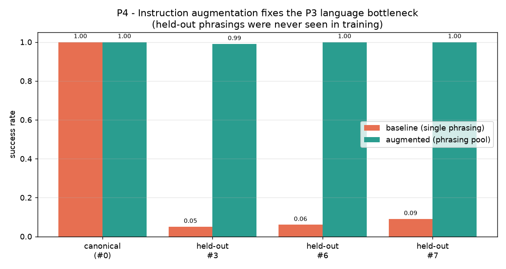

# P4: Fixing the language bottleneck (closes the P3 loop)

P3 diagnosed the VLA's failure: it is **language-brittle**, collapsing to about 6% on unseen
instruction phrasings. P4 fixes it. The hypothesis is that the brittleness is a
*training-distribution coverage* problem, not a fundamental limit, and the fix is
**instruction augmentation**: train on a distribution of phrasings instead of one.

## The one-sentence idea

Train a second, architecturally identical policy on a **pool of instruction phrasings**, then
test it on **held-out phrasings it never saw during training**. If success recovers, the
brittleness was caused by narrow language coverage, exactly as a deployment engineer would
fix it.

## Setup

- **Train phrasings:** templates {0, 1, 2, 4, 5} (e.g. "reach the red object", "go to the red
  one", "navigate towards the red target", ...).
- **Held-out test phrasings:** templates {3, 6, 7} (e.g. "move to red", "drive to the red
  circle", "find the red object and touch it"). These never appear in training.
- **Baseline:** `results/policy.pt`, the P3 policy trained on the canonical phrasing only.
- **Augmented:** `results/policy_aug.pt`, identical model trained on the phrasing pool.

The two policies use the **same architecture and the same small text encoder**, so the only
variable is the diversity of training language. Phrasings are sampled per episode via
`Perturbation(template_pool=...)` in `src/vlawm/envs/reach.py`.

## How to run

Needs the P3 baseline policy (`results/policy.pt`). Trains the augmented policy on first run.

```bash
uv run python scripts/train_policy.py --episodes 2500 --epochs 60   # if policy.pt missing
uv run python p4_language_robustness/run_language_robustness.py      # → results/p4_language_robustness.png
```

## Result



| Phrasing | Baseline (single phrasing) | Augmented (phrasing pool) |
|---|---|---|
| canonical (#0) | 1.00 | 1.00 |
| held-out #3 | 0.05 | 0.99 |
| held-out #6 | 0.06 | 1.00 |
| held-out #7 | 0.09 | 1.00 |

**Instruction augmentation closes the gap.** On phrasings never seen in training, the baseline
scores 0.05 to 0.09 while the augmented policy scores 0.99 to 1.00, with no loss on the
canonical phrasing. The P3 brittleness was a coverage problem: exposed to varied phrasings,
the policy learns to ground the invariant (the color word) and ignore the surrounding
wording.

## Scope note (state this yourself)

This fixes the **paraphrase** axis from P3 (language-side generalization). It does not, by
itself, fix the **novel-color** axis, which requires *visual* generalization to an unseen
attribute, not just language coverage. The two are different generalization problems; P4
addresses the language one cleanly and isolates it as the cause.

Code: `p4_language_robustness/run_language_robustness.py`,
`src/vlawm/envs/reach.py` (`template_pool`).

---

# Write-up

A structured account of this study in the format of a short research note, mapping the
content onto Introduction, Related Work, Method, Experiments, Results, Discussion,
Limitations, and Future Work.

## 1. Introduction

A vision-language-action policy that succeeds in-distribution can still fail on benign
rewordings of its instructions, a brittleness quantified in P3 (success drops from 100% to
about 6% under paraphrase). Whether this reflects a fundamental limit of the model or merely
narrow training coverage has direct practical consequences: the former calls for new
architectures, the latter for better data. This study tests the coverage hypothesis directly.

We ask:

> **Is the VLA's language brittleness caused by narrow training coverage, such that training on
> a distribution of phrasings restores robustness to held-out phrasings?**

The answer is yes: with the architecture and text encoder held fixed, augmenting the training
phrasings raises held-out paraphrase success from under 0.10 to about 1.00.

## 2. Related work

- **Instruction augmentation for robot policies.** Large VLA efforts (RT-2, Brohan et al.,
  2023; OpenVLA, Kim et al., 2024) train on diverse, naturally varied language, which is widely
  credited for their instruction-following robustness; this study isolates that effect in a
  controlled setting.
- **Data augmentation and invariance.** Training over a transformation distribution to induce
  invariance is a classic generalization technique; here the transformation is paraphrasing
  and the desired invariant is the referenced object attribute.
- **Compositional and lexical generalization in grounded language.** Generalizing to unseen
  phrasings of seen concepts is a well-studied challenge for instruction-conditioned agents.

## 3. Method

Two policies, identical in architecture (FiLM language-conditioned vision encoder with
spatial-softmax keypoints) and in the small bag-of-embeddings text encoder, differ only in the
diversity of training language. The baseline is trained on a single canonical phrasing; the
augmented policy is trained on a pool of five phrasings sampled per episode. Both are evaluated
on three held-out phrasings absent from the augmented policy's training pool, so the test
measures generalization rather than memorization.

## 4. Experiments

We evaluate both policies over 100 fixed-seed episodes per phrasing on the canonical phrasing
(in-distribution reference) and on each held-out phrasing. All other factors (distractor
count, colors, visual conditions) are held at training values so language phrasing is the only
variable.

## 5. Results

On the canonical phrasing both policies reach 1.00. On the three held-out phrasings the
baseline scores 0.05, 0.06, and 0.09, while the augmented policy scores 0.99, 1.00, and 1.00.
Augmentation therefore eliminates the paraphrase gap without degrading in-distribution
performance.

## 6. Discussion

The result localizes P3's language brittleness to training-distribution coverage rather than to
model capacity or the encoder. Exposed to varied phrasings of the same goal, the policy learns
to rely on the invariant content word (the color) and to discount the variable surrounding
wording. Practically this argues that instruction diversity at training time is a cheap and
effective lever for language robustness, consistent with how large VLAs are trained.

## 7. Limitations

- The fix addresses language-side generalization (paraphrase) and not visual generalization to
  unseen attributes (novel colors), which remains an open axis from P3.
- The phrasing pool is small and templated; natural language exhibits far greater variation.
- The text encoder is minimal; whether a pretrained text encoder would generalize from even a
  single phrasing (zero augmentation) is a natural follow-up.

## 8. Future work

- Replace the bag-of-embeddings encoder with a pretrained text encoder and measure how much
  augmentation is still needed.
- Extend to compositional instructions (multiple attributes, spatial relations, negation).
- Combine with a world-model consistency check (P1 machinery) to detect residual language
  failures before acting.

## Reproducibility

`uv run python p4_language_robustness/run_language_robustness.py` trains the augmented policy
(if not cached) and regenerates the figure and metrics. Evaluation seeds are fixed in the
harness.
